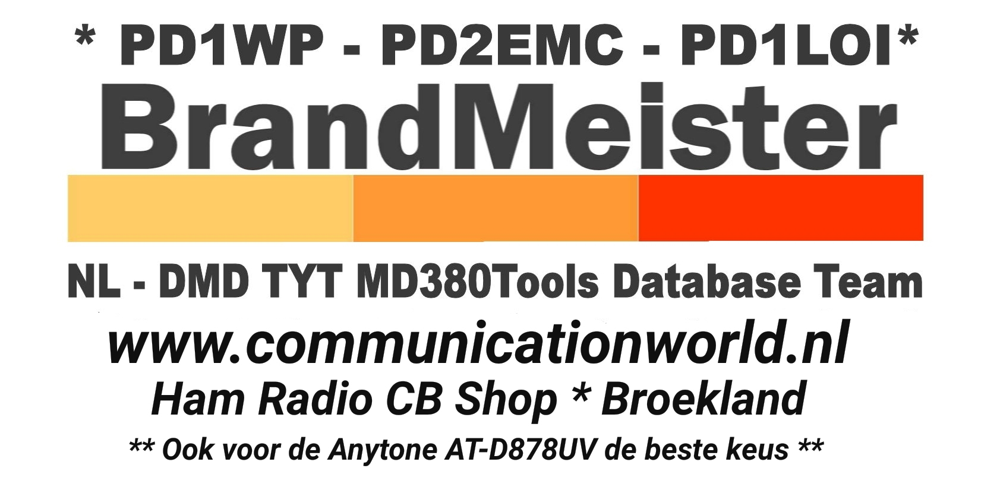

# 
Latest UserDB for MD380,MD390 & HD1
 

<a href="#dutch">Dutch</a> - 
<a href="#english">English</a> - 
<a href="#german">German</a> -
<a href="#helpus">Mandarin Chinese</a> -
<a href="#helpus">Hindi</a> -
<a href="#helpus">Spanish</a> -
<a href="#helpus">Arabic</a> -
<a href="#helpus">Portuguese</a> -
<a href="#helpus">Russian</a> -
<a href="#helpus">Japanese</a> -
<a href="#helpus">All others</a>

<h2 id="dutch">Nieuwste UserDB voor MD380,MD390 & HD1 met of zonder GPS</h2>
<b>MD380 & MD390</b>
 
De database wordt samen gebruikt met de TyteraFlashTool v1.04a KD4Z van KG5RKI en aangepast door PD1LOI.
<li>
<a href="https://github.com/PD1LOI/MD380tools/blob/master/TyteraFlashToolv1.04a-KD4Z.rar">TyteraFlashTool v1.04a</a>
</li><li>
<a href="https://github.com/PD1LOI/MD380tools/raw/master/user.bin">Database voor MD380 & MD390</a>
</li>
 
<b>HD1</b>
 
De database wordt samen gebruikt met de Ailunce HD1 AdresTool v1.01 KD4Z van KG5RKI en aangepast door PD1LOI.
<li>
<a href="https://github.com/PD1LOI/MD380tools/blob/master/Ailunce%20HD1-AdresTool-v%201.01.zip">Ailunce HD1 AdresTool v1.01</a>
</li><li>
<a href="https://github.com/PD1LOI/MD380tools/raw/master/userhd.csv">Database voor HD1</a>
</li>
 
Voor MD380-MD390 : Als je zelf de database aanpast vergeet niet het aantal karakers in te vullen op de eerste regel. Voorbeeld onderop de tab van notepad++ te zien. Voorbeeld Lengte: 4,275,525 vul dit getal in op de eerste regel zonder komma's dus zo 4275525.

<h2 id="english">Latest UserDB for MD380,MD390 & HD1 with or without GPS</h2>
<b>MD380 & MD390</b>
 
The database is used together with TyteraFlashTool v1.04a KD4Z made by KG5RKI and modified by PD1LOI. 
<li>
<a href="https://github.com/PD1LOI/MD380tools/blob/master/TyteraFlashToolv1.04a-KD4Z.rar">TyteraFlashTool v1.04a</a>
</li><li>
<a href="https://github.com/PD1LOI/MD380tools/raw/master/user.bin">Database voor MD380 & MD390</a>
</li>
 
<b>HD1</b>
 
The database is used together with Ailunce HD1 AdresTool v1.01 KD4Z made by KG5RKI and modified by PD1LOI.
<li>
<a href="https://github.com/PD1LOI/MD380tools/blob/master/Ailunce%20HD1-AdresTool-v%201.01.zip">Ailunce HD1 AdresTool v1.01</a>
</li><li>
<a href="https://github.com/PD1LOI/MD380tools/raw/master/userhd.csv">Database for HD1</a>
</li>
 
For MD380-MD390 : If you edit the database by yourself do not forget to fill in the number of characters on the first line. Preview at the bottom of Notepad tab. Example Length: 4,275,525 Enter this number on the first line without commas thus 4275525.

<h2 id="german">Neueste UserDB für MD380, MD390 & HD1 mit oder ohne GPS</h2>
<b>MD380 & MD390</b>
 
Die database wird zusammen mit dem TyteraFlashTool v1.04a KD4Z von KG5RKI und von PD1LOI modifiziert verwendet.
<li>
<a href="https://github.com/PD1LOI/MD380tools/blob/master/TyteraFlashToolv1.04a-KD4Z.rar">TyteraFlashTool v1.04a</a>
</li><li>
<a href="https://github.com/PD1LOI/MD380tools/raw/master/user.bin">Database voor MD380 & MD390</a>
</li>
 
<b>HD1</b>
 
Die database wird zusammen mit dem Ailunce HD1 AdresTool v1.01 KD4Z von KG5RKI und von PD1LOI modifiziert verwendet.
<li>
<a href="https://github.com/PD1LOI/MD380tools/blob/master/Ailunce%20HD1-AdresTool-v%201.01.zip">Ailunce HD1 AdresTool v1.01</a>
</li><li>
<a href="https://github.com/PD1LOI/MD380tools/raw/master/userhd.csv">Database for HD1</a>
</li>
 
Fũr MD380-MD390 : Wenn sie die database selbst anpassen vergessen Sie nicht, die Anzahl der Zeichen in der ersten Zeile einzugeben. Vorschau am unteren Rand des Notizblock. Beispiel Länge: 4.275.525 Geben Sie diese Zahl in der ersten Zeile ohne Kommas ein, also 4275525.

<h1 id="helpus">Sorry we did not find your language</h1>
 
Your language here ? send me the text pd2emc at outlook.com :)

